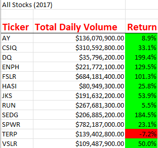
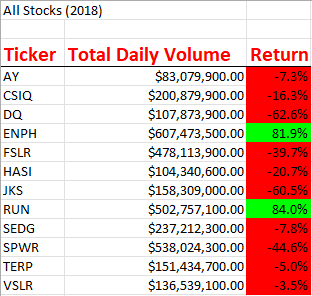
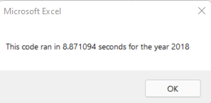
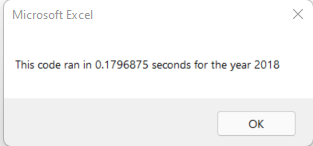

# Stock Analysis Using VBA
### Overview of Project

This dataset presents  2017 and 2018 stock data for analysis to make the client to make best investment decisions. Using VBA, I analyzed trends on 12 stocks over the two years to uncover the volume traded and the percentage return at the end of the year. 

### Results

My analysis shows that all 12 stocks performed significantly better in 2017 compared to 2018. 

-  Figure 1 below shows that in 2017,  all except the TERP stock gained in value with four of the stock seeing gains above 100% at the end of the year. 

  

  ​					*Figure 1: 2017 analysis results*

- Figure 2 below shows that in 2018, 10 of the 12 stocks experienced losses in value. The ENPH and RUN saw gains of over 80% which significant despite the apparently difficult financial year. 



​						*Figure 2: 2018 analysis results*

### The VBA Code

When I first wrote the code, each of the 12 tickers (stand-in for stock names) would be checked in a loop, and the code executed to check for the starting and ending price. This essentially meant the entire dataset was run 12 times which can be resource and time consuming. See code snippet below. 

```vbscript
For RowIndex = rowStart To rowEnd
    'Find starting price
    If Cells(RowIndex, 1).Value = ticker And 				Cells(RowIndex - 1, 1).Value <> ticker Then
    startingPrice = Cells(RowIndex, 6).Value
    End If
    
    'Find ending price
     If Cells(RowIndex, 1).Value = ticker And 					Cells(RowIndex + 1, 1).Value <> ticker Then
     endingPrice = Cells(RowIndex, 6).Value
    End If
Next RowIndex
```

Figure 3 below shows the time it took to run the version of the code for the year 2018. I had similar time output for 2017.



​						*Figure 3: Time taken to run script on 2018*

In the next iteration, I refactored the code so that instead of the code running through the data for each of the the independent variables, I created output arrays to hold the results for each iteration. So the next time the code was checking, it read the results into the output arrays.

```vbscript
    '1b) Create three output arrays
    Dim tickerVolumes(12) As Long
    Dim tickerStartingPrices(12) As Single
    Dim tickerEndingPrices(12) As Single
```

 The code ran in a much shorter time when refactored to be more efficient. Figure 4 below shows the time it took to run the code for 2018. I saw a similar time output for 2017. 



​						*Figure 4: Time taken to run refactored script on 2018*

### Summary

*What are the advantages or disadvantages of refactoring code?*

*How do these pros and cons apply to refactoring the original VBA script?*

**Advantages**

- The advantage of refactoring code is that it uses less time and memory resources to run through a dataset and output results. 

**Disadvantages**

- The disadvantage is that the code is not as verbose as less efficient code. So if another person was looking at the code in the future, it might be less readable. 
- It can also be challenging to refactor code that you have been working on as it might break and it might be challenging to debug. I definitely ran into the problem during my refactoring process, I had to attend office hours and a tutoring session to get a second pair of eyes in the debugging process.

